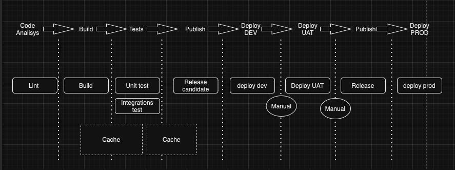

**Schedule Hub**

# Project Structure
    schedulehub/
    ├── cmd/                                  # Main application entry points
    │   ├── api/
    │   │   ├── main.go                       # Main entry point for the API - Start Web server
    ├── configs/                              # Configuration files
    ├── controller/                           # Controller logic
    │   ├── controller.go                     # Controller implementation
    ├── domain/                               # Domain logic
    │   ├── config.go                         # Domain configuration
    ├── service/                              # Service layer
    │   ├── service.go                        # Service implementation
    ├── external/                             # External dependencies or integrations
    ├── interfaces/                           # Interfaces for generic stuff
    │   ├── location_interface.go             # location interface
    │   ├── schedule_interface.go             # schedule configuration
    │   ├── token_interface.go                # token configuration
    │─── carriers_factory.go                  # Factory for carrier interfaces
    │─── cma.go                               # CMA carrier logic
    │─── hapag.go                             # Hapag-Lloyd carrier bizlogic
    │─── helper.go                            # Helper functions
    │─── iqax.go                              # OOLU COSCO carrier biz logic
    │─── maersk.go                            # Maersk carrier biz logic
    │─── msc.go                               # MSC carrier biz logic
    │─── one.go                               # ONE carrier biz logic
    │─── zimu.go                              # ZIM carrier biz logic
    ├── internal/                             # Internal logic (not accessible externally)
    ├── database/                             # Database management
    │   ├── oracle.go                         # Oracle database logic
    │   ├── redis.go                          # Redis database logic
    ├── exceptions/                           # Exception handling
    │   ├── tracker.go                        # Tracker exception handling
    ├── handlers/                             # Request handlers
    │   ├── filter_map.go                     # Filter and map logic
    │   ├── health_check.go                   # Health check handler
    │   ├── master_voyage.go                  # Master voyage handler
    │   ├── master_voyage.sql                 # SQL for master voyage
    │   ├── p2p_schedules.go                  # P2P schedules handler
    │   ├── stream_service.go                 # P2P Stream service(Part Of P2P schedules handler)
    ├── http/                                 # HTTP client logic
    │   ├── config.go                         # HTTP client configuration
    │   ├── http_client.go                    # HTTP client client implementation
    ├── middleware/                           # Middleware
    │   ├── app_config.go                     # App configuration middleware
    │   ├── correlationID.go                  # Correlation ID middleware
    │   ├── cors.go                           # CORS middleware
    │   ├── http_headers.go                   # HTTP headers middleware
    │   ├── logging.go                        # Logging middleware
    │   ├── middleware_stack.go               # MiddlewareStack Function
    │   ├── query_validator.go                # Query validation middleware
    │   ├── recovery.go                       # Recovery middleware
    ├── routers/                              # API routers
    │   ├── app_config_router.go              # App configuration routes
    │   ├── schedule_router.go                # Schedule-related routes
    │   ├── voyage_router.go                  # Voyage-related routes
    ├── schema/                               # API schema definitions
    │   ├── master_voyage_schema.go           # Master voyage schema
    │   ├── p2p_schema.go                     # P2P Schedule schema
    │   ├── request_element.go                # Request element schema
    │   ├── request_schema.go                 # Request schema
    ├── secret/                               # Secret management
    │   ├── env.go                            # Environment variables
    │   ├── errors.go                         # Error handling
    │   ├── validator.go                      # Validation logic
    ├── tests/                                # Unit and integration tests
    ├── .gitignore                            # Git ignored files configuration
    ├── config.yaml                           # Configuration file
    ├── docker-compose.yml                    # Docker Compose configuration
    ├── Dockerfile                            # Docker configuration for containerization
    ├── go.mod                                # Go module configuration
    ├── go.sum                                # Go module configuration
    ├── MakeFile                              # Task Automation
    ├── README.md                             # Project documentation

## P2P Schedule API hub
/schedule/p2p  which aggregates the P2P Schedules APIs of the following Carriers:

ANNU, ANRM, APLU, CHNL, CMDU, COSU, HDMU, MAEI, MAEU, MSCU, ONEY, OOLU,ZIMU

Other Carriers currently do not offer such an API.

## Master Vessel Voyage
/schedule/vv  which return master vessel voyage for  all the IB carriers, providing the latest voyage route. 

## App Configuration
/read/{service.registry}  read the application config which does not require web server restart if any change made. 

Tested under Go 1.23.2.

For a list of dependencies, please refer to go.mod . Keep in mind that all the original json response are cached in a RedisDB

**TODO:** Currently the .env file contains several secrets, these should be removed from there. Locally the need to be
stored in a gitignored file, in OCP they can be provided via Secret.

**TODO:** If we use redis.go,please setup redis, put the credential into env file

#### Decrypt secrets for dev with sops

* go to `cicd/terraform/environment/<env>`
* next command add correct KMS Arn, profile and path env
* sops -d --in-place --kms arn:aws:kms:eu-xxxxx-1:934512312312313:key/00000000-0000-0000-0000-000000000000 --aws-profile [<env> profile] environments/<env>/secrets.yaml
* duplicate `.env.example` and rename to `.env`, copy the decrypted values to `.env`

## Run Go Application locally with IntelliJ,Redis

Reference: https://tutorialedge.net/golang/makefiles-for-go-developers/

Basically you can make use of Makefile to automate all the task.

if you d like to check the code quality like lint and dependencies and reformat the code , please use 'make check-quality' in Ubuntu terminal.

if you d like to compile and run the application, please use 'make run' in Ubuntu terminal.

if you d like to clean out the binary file, please use 'make clean'in Ubuntu terminal.

There are so many 'target' we can use. For the details,please check the MakeFile

### Dependencies:

* go 1.23.2 or higher
* Redis 

### Step 0. Install with Docker Redis before start:

* docker run -d --name redis-stack-server -p 6379:6379 redis/redis-stack-server:latest

* Add/replace in .env file the next lines
  ``
  REDIS_HOST = localhost
  REDIS_PORT = 6379
  REDIS_DB = 0
  REDIS_USER = None
  REDIS_PW = None
  ``

### Step 1. Install go packages. Run these commands on your terminal:

### Step 2. Run this command:

* make run

* Example - P2P Schedule API hub
  * http://127.0.0.1:8002/schedules/p2p?startDateType=Departure&searchRange=4&pointFrom=CNSHA&pointTo=DEHAM&startDate=2025-04-11

* Example - Master Vessel Voyage
  * http://127.0.0.1:8003/schedules/vv?scac=ANNU&vesselIMO=9348675&voyageNum=0Y1J1S1NL
    
* Example - Application Config
  * http://127.0.0.1:8004/read/service.registry.schedule

  
* OpenAPI - Swagger UI

* OpenAPI Specs - Swagger

# CICD Workflow

This section describes the CICD workflow.

## Stages and jobs

1. **Code Analysis**: In this stage, we will check code with lint, sonar, etc
2. **Build**: The build stage will be responsible for packaging the applications or creating a docker image to be pushed
   to the images repository. In this stage, a should be created a cache to change files generated by the build.
3. **Tests**: Tests are important in every project. This stage should aggregate the Unit test and the Integrations test.
5. **Publish**: A release candidate is created to be deployed in DEV and UAT environments.
6. **Deploy DEV**: Deploy the release candidate in the DEV environment
7. **Deploy UAT**: Deploy the release candidate in the UAT environment
8. **Publish**: Promote the release candidate to a final release
9. **Deploy PROD**: Deploy the release in a Production environment.